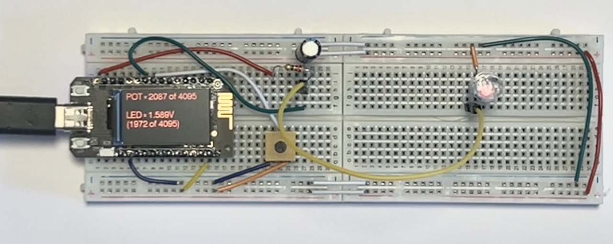
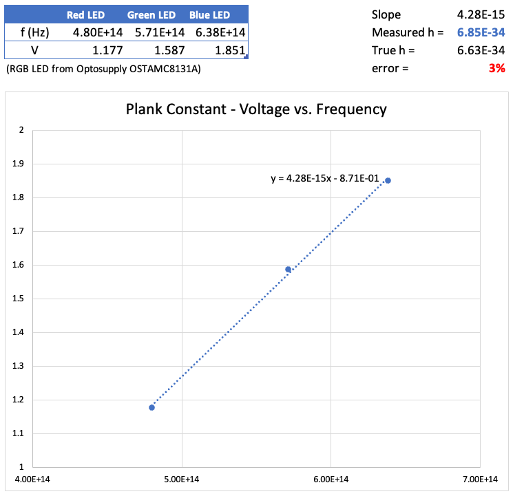
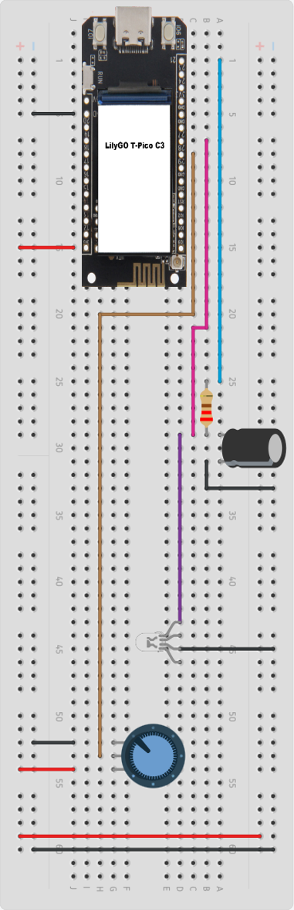

# Measuring Planck's Constant using a using an RGB LED

## What is this?

This project uses a [LilyGO T-PicoC3](https://github.com/Xinyuan-LilyGO/T-PicoC3) connected to an RGB LED to determine [Planck's Constant](https://en.wikipedia.org/wiki/Planck_constant).

Details on how this is done, from a theoretical perspective, can be found on this nice article: [Classroom fundamentals - measuring the Planck constant](https://www.scienceinschool.org/article/2014/planck/).

Using this circuit it's relatively easy to measure *h* within a 10% error.

In fact, we've measured _h_ to be **6.63E-34 J/Hz**. That corresponds to an error of only 3%!

 

## Principle of operation

One of the amazing things that you can do at home is measuring the Planck's Constant with a high degree of accuracy. All that you need is a voltmeter, a few coloured LEDs and a dark place. Basically, all that you need to do know is the frequency of the light each LED emits and determine very very exactly the turn-on voltage for each of the LEDs. Given that _E = h*f_, where E is the energy need to emit a photon (with a frequency f)  by an LED you can readily get h. In fact, for some technical reasons you don't want to do that directly, but instead do a regression using the data of several LEDs, where h is the slope _E(f) = h*f_.

Please refer to this document [Measuring Planck's Constant](PlanckConstant_TeachersGuide.pdf) for all the scientific details around this.

The circuit uses a T-PicoC3 to generate a voltage on PIN28 using its internal PWM. In order to get a "clean" voltage, PIN 28 is connected to a low pass filter consisting of a resistor and a capacitor. Its cut-out frequency is about 13Hz, with a settle time of about 60 msec. The generated clean voltage is then fed to the LED and its value shown on the TFT display.

## Materials needed

* 1x Full-size breadboard
* 1x [LilyGO T-PicoC3](https://github.com/Xinyuan-LilyGO/T-PicoC3)
* 1x RGB LED (I've used Optosupply OSTAMC8131A)
* 1x 220 ohm resistor
* 1x 56uF capacitor
* 1x 10k potentiometer
* Jump wires

## Instructions

Connect the T-PicoC3 according to the schematic below.

In particular, be careful about the following pins:

* PIN 21 - GP21 - Resistor
* PIN 27 - ADC1 - Positive size of the capacitor
* PIN 28 - ADC2 - Mid-point of the potentiometer

In the circuit above, you have a purple wire that connects the positive terminal of the capacitor to the anode of the Red LED. When using the circuit you will need to manual move the end of that wire from the anode of the Red LED to the Green one and, finally, to the Blue one.

## How to use the circuit

You need to complete the following procedure for the Red, Green and Blue LEDs.

1. Make sure that you have a wire connecting the positive side of the capacitor (purple wire) to either the Red, Green or Blue LED anode, but only one of them -- the one you are currently measuring.

2. In a completely dark place and after you have adjusted your eyes to the darkness, turn the potentiometer down until you are not able to see the LED shinning anymore. Then, turn it up until you see it again.

3. Use the buttons on the T-PicoC3 to make small fine adjustments to the voltage. Use the first button to increase the voltage. One click moves the voltage slightly up; a double click to moves it quite some more. The same applies to the second button but to lower the voltage.

4. Once you are sure about the turn-on voltage for that LED, write down the value.

Repeat this procedure for the other two LEDs (you will need to move the purple jumpwire for that).

Once you have completed all the measurements you can use the [Excel Spreadsheet](PlankConstantCalculation.xlsx) to calculate Planck's constant. Note that if you have used a LED with a different spec you will need to adjust the frequencies of each color.

## How to compile and run

Requirements:

* Make sure that you have [Visual Studio Code](https://code.visualstudio.com) installed
* Make sure that you have [Platform IO](https://platformio.org) installed
* Make sure that you have the [C/C++ for Visual Studio Code](https://github.com/microsoft/vscode-cpptools) installed

If you have all these installed, simply open the project in PlatformIO, hit the "build" and "upload" buttons.

## License

[Apache 2.0](LICENSE)
